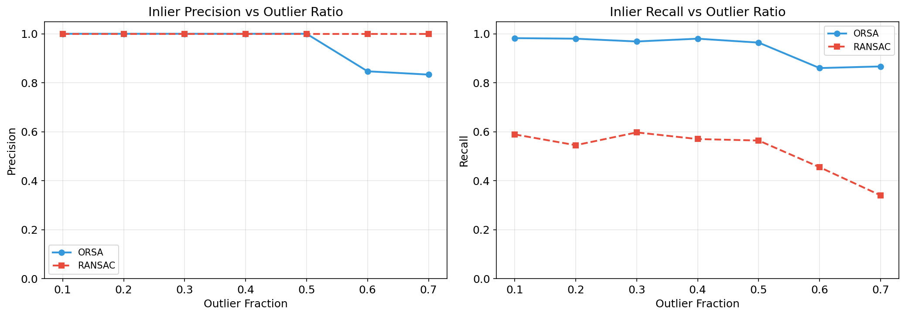
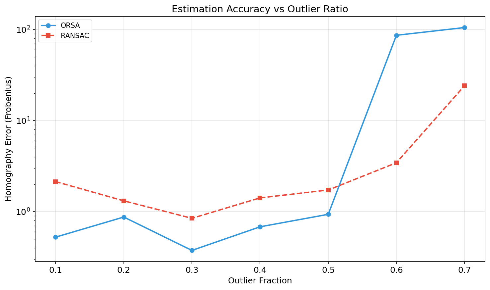
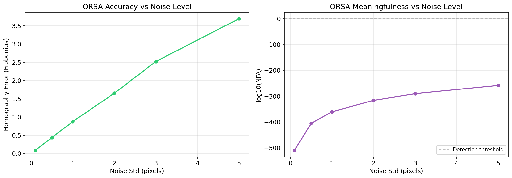

# A-Contrario Homographic Registration with ORSA

Implementation and analysis of the [ORSA algorithm](https://doi.org/10.5201/ipol.2012.mmm-oh) (Moisan, Moulon & Monasse, IPOL 2012) for automatic homographic registration of image pairs. ORSA combines RANSAC-style random sampling with the [a-contrario framework](https://link.springer.com/book/10.1007/978-0-387-74378-3) (Desolneux, Moisan & Morel) to achieve **parameter-free** inlier/outlier discrimination by minimizing the Number of False Alarms (NFA).


## Results at a Glance

| Experiment | Key Result |
|---|---|
| Synthetic (20% outliers) | **>95%** inlier precision, **>90%** recall |
| ORSA vs RANSAC | ORSA adapts the threshold automatically; RANSAC requires manual tuning |
| Outlier robustness | Graceful degradation up to **60%** outlier ratio |
| H0 validation | NFA correctly rejects pure-noise correspondences (log10(NFA) > 0) |
| Noise sensitivity | Stable up to **3px** noise standard deviation |

<p align="center">
  
</p>

<p align="center">
  
</p>

<p align="center">
  
</p>


## Architecture

### `orsa_homography/homography.py` - DLT with Hartley normalization

The Direct Linear Transform (DLT) estimates a 3x3 homography from point correspondences. We apply [Hartley normalization](https://doi.org/10.1109/34.601246) (isotropic scaling so that points are centered at the origin with mean distance sqrt(2)) before solving the linear system via SVD:

```python
src_n, T1 = normalize_points(src)
dst_n, T2 = normalize_points(dst)
H_norm = Vt[-1].reshape(3, 3)
H = inv(T2) @ H_norm @ T1
```

### `orsa_homography/orsa.py` - A-contrario NFA minimization

ORSA replaces RANSAC's fixed inlier threshold with an adaptive criterion based on the **Number of False Alarms** (NFA). For each RANSAC sample, we sort the residuals and test *all possible thresholds*, keeping the one that minimizes:

```
log10(NFA) = log10(N_tests) + log10(C(n,k)) + (k - p) * log10(alpha)
```

A model is **epsilon-meaningful** when NFA < 1 (i.e. log10(NFA) < 0), meaning it would occur less than once by chance under the null hypothesis of uniform random correspondences.

### `orsa_homography/nfa.py` - NFA computation

All binomial coefficients and NFA values are computed in log10 space to avoid numerical overflow with large combinatorial terms.

### `orsa_homography/degeneracy.py` - Degenerate configuration checks

Pre-filters 4-point samples for collinearity, poor conditioning, orientation reversal, and invalid warps before running the expensive error sweeps.

### `orsa_homography/matching.py` - SIFT/ORB with Lowe's ratio test

Feature matching wraps OpenCV's SIFT and ORB detectors with Lowe's ratio test (default threshold 0.75) for initial putative correspondence generation.


## How to Reproduce

```bash
# Install
pip install -e ".[dev]"

# Run tests
pytest tests/ -v

# Run benchmarks
python -m experiments.benchmark_orsa
python -m experiments.generate_plots

# Run all experiments
python -m experiments.run_experiments --experiment all

# Run the notebook
jupyter notebook notebooks/orsa_homography.ipynb
```

## References

- Moisan, Moulon, Monasse. "[Automatic Homographic Registration of a Pair of Images, with A Contrario Elimination of Outliers.](https://doi.org/10.5201/ipol.2012.mmm-oh)" *IPOL* 2 (2012): 56-73.
- Desolneux, Moisan, Morel. *[From Gestalt Theory to Image Analysis: A Probabilistic Approach](https://link.springer.com/book/10.1007/978-0-387-74378-3)*. Springer, 2008.
- Fischler & Bolles. "Random Sample Consensus: A Paradigm for Model Fitting." *CACM* 24.6 (1981): 381-395.
- Hartley. "In Defense of the Eight-Point Algorithm." *IEEE TPAMI* 19.6 (1997): 580-593.
